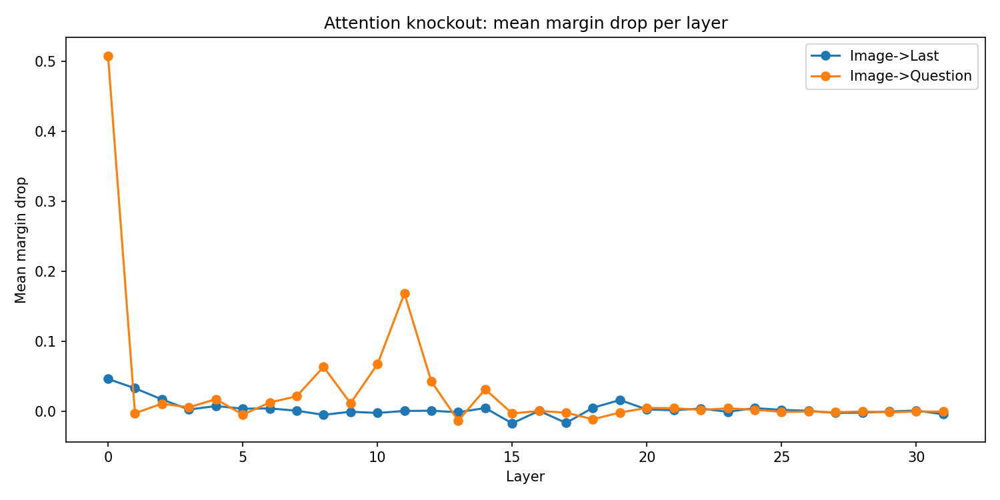
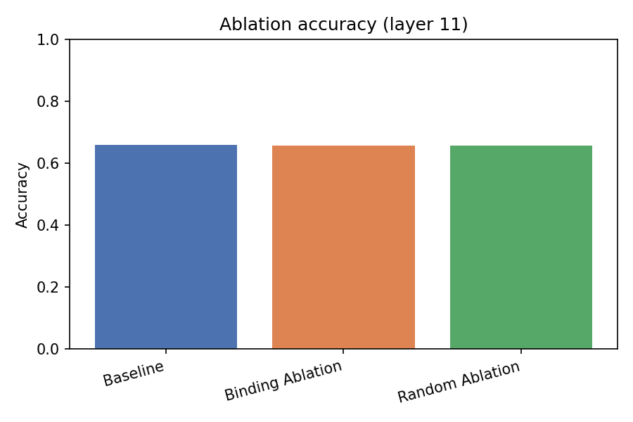
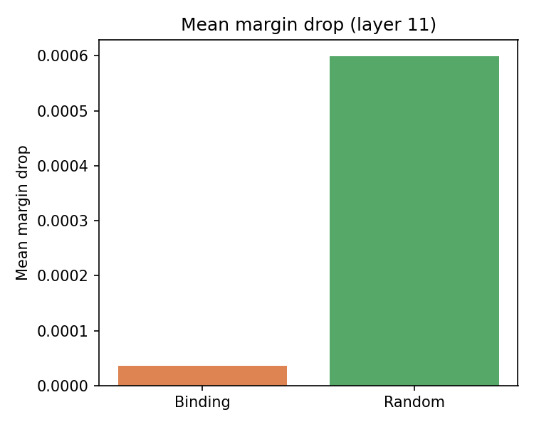
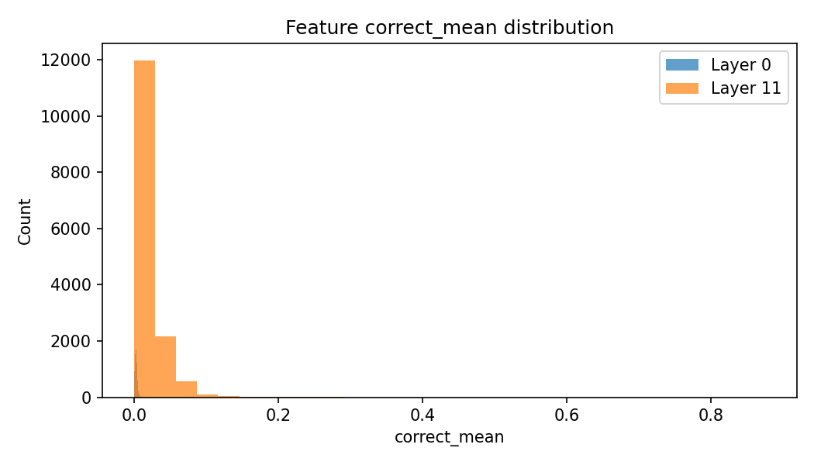
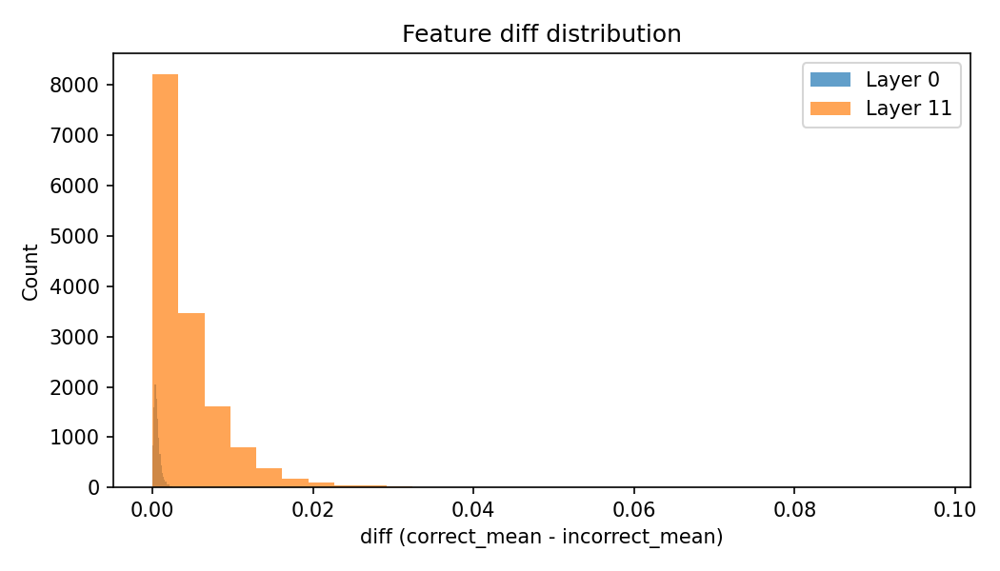

# Cross-Modal Information Flow and SAE-Based Feature Analysis in LLaVA-1.5-7B

## Introduction
This report summarizes the current state of the cross-modal information flow project, which investigates how image information is integrated into text reasoning in a multimodal LLM (LLaVA‑1.5‑7B), and whether sparse, interpretable features (learned with sparse autoencoders, SAEs) can be identified as causal mediators of that integration. The project is grounded in the attention-knockout methodology implemented in the original repository and extends it with an SAE-based feature discovery and ablation pipeline.

The primary research question is: **Where and how does cross‑modal information (image → text) flow within the model, and can we identify sparse internal features whose intervention causally affects task performance?**

We have now completed: (1) a corrected attention-knockout sweep across all layers, (2) SAE training for two candidate layers (0 and 11), (3) feature identification for those layers, and (4) ablation for layer 11 with corrected log-probability indexing.

## Background

### Attention Knockout
The baseline methodology blocks selected attention edges (e.g., image tokens → question tokens) inside the self-attention mechanism at specific layers. The model’s behavior is re-evaluated and changes in answer probability are used as evidence for causal flow. This is implemented in the original codebase (`InformationFlow.py`, `methods.py`) and was replicated in a forced-choice sweep across layers.

### Sparse Autoencoders (SAEs)
SAEs are trained on the residual stream activations of a specific transformer block, producing sparse feature activations. The hypothesis is that some of these sparse features correspond to semantically meaningful or causally relevant mechanisms. We identify candidate features by comparing activations on correct vs incorrect examples and then ablate those features to test causal necessity.

## Method

### Knockout Sweep (Corrected Forced‑Choice)
We compute a forced-choice margin for each sample and measure the margin drop after blocking image→question or image→last attention edges:

\[ 	ext{margin} = \log p(	ext{true option}) - \log p(	ext{false option}) \]

The sweep covers all 32 layers with window=1. The log-probability indexing bug (ignoring multimodal token expansion) has been fixed, yielding meaningful layer-wise effects.

### SAE Training and Feature Identification
Two SAEs were trained at layers 0 and 11 (chosen from knockout peaks). Features were identified using correctness metrics based on forced-choice logprobs (also corrected for multimodal token expansion). For each layer, we saved feature statistics, top‑K feature catalogs, and visualization PNGs.

### Feature Ablation
Features selected for each layer are ablated by zeroing their SAE activations and reconstructing the residual stream. The ablation is evaluated via generation accuracy and forced‑choice logprob margins. We compare binding-feature ablation against random-feature ablation.

## Results

### Knockout Sweep (Corrected)
The corrected knockout sweep shows strong layer-dependence for image→question flow and weaker effects for image→last flow. Early layers (0–2) and a mid-layer band (≈8–12) show the largest mean margin drops for image→question.

**Top layers by mean margin drop (Image->Last)**

| Layer | Mean margin drop | Effect size | p-value | Samples |
| --- | --- | --- | --- | --- |
| 0 | 0.04665 | 0.1984 | 2.302e-08 | 810 |
| 1 | 0.03328 | 0.4243 | 5.85e-31 | 810 |
| 2 | 0.0174 | 0.5904 | 1.627e-54 | 810 |
| 19 | 0.01652 | 0.3916 | 6.545e-27 | 810 |
| 4 | 0.00791 | 0.328 | 9.934e-20 | 810 |

**Top layers by mean margin drop (Image->Question)**

| Layer | Mean margin drop | Effect size | p-value | Samples |
| --- | --- | --- | --- | --- |
| 0 | 0.5085 | 0.8062 | 4.857e-90 | 810 |
| 11 | 0.1688 | 0.6054 | 7.623e-57 | 810 |
| 10 | 0.06758 | 0.3806 | 1.357e-25 | 810 |
| 8 | 0.06387 | 0.4135 | 1.381e-29 | 810 |
| 12 | 0.043 | 0.3076 | 1.242e-17 | 810 |

### SAE Feature Identification
Feature statistics indicate that layer 11 features have much larger activation magnitudes and absolute differences than layer 0 features. Layer 0 features are extremely small in magnitude (median correct_mean ≈ 4e‑5), while layer 11 features are ≈ 3–8e‑3. This suggests layer 11 has stronger feature signal, but does not guarantee causal impact.

**Feature magnitude comparison (layer 0 vs layer 11):**

| Layer | Median correct_mean | Max correct_mean | Median diff | Max diff |
| --- | --- | --- | --- | --- |
| Layer 0 | 0.002644 | 0.01969 | 0.0005038 | 0.004324 |
| Layer 11 | 0.008664 | 0.8753 | 0.002756 | 0.0971 |

### Feature Ablation (Layer 11)
The ablation results for layer 11 show that binding-feature ablation yields nearly identical accuracy drop to random-feature ablation. The corrected margin metrics show a very small mean margin drop for binding features, smaller than the random ablation drop.

| Condition | Accuracy | Accuracy drop | Mean margin drop |
| --- | --- | --- | --- |
| Baseline | 0.6591 | 0 | 0 |
| Binding Ablation | 0.6579 | 0.00114 | 3.653e-05 |
| Random Ablation | 0.6579 | 0.00114 | 0.000599 |

## Visualizations

**Figure 1. Knockout sweep mean margin drop by layer (Image→Question vs Image→Last)**

**Figure 2. Ablation accuracy (layer 11)**

**Figure 3. Mean margin drop in ablation (layer 11)**

**Figure 4. Distribution of SAE feature correct_mean (layer 0 vs layer 11)**

**Figure 5. Distribution of SAE feature diff (layer 0 vs layer 11)**

## Discussion

### Interpretation of Findings
The corrected knockout sweep provides strong evidence that specific layers (especially early and mid layers) mediate image→question information flow. This supports the hypothesis that cross‑modal integration is not uniform across depth. However, the SAE pipeline has not yet identified features with clear causal impact.

The ablation results for layer 11 indicate that the selected SAE features are *not* more causally important than random features: both binding and random ablations lead to the same small accuracy drop (~0.11%). This weak effect, combined with the lack of superiority over random ablation, suggests either:

1. The SAE features do not capture the causal mechanism despite being located in a causally important layer; or
2. The ablation intervention is too weak or too localized to disrupt behavior; or
3. The feature selection metric (correct vs incorrect mean activation) does not isolate causally relevant features.

### Relationship to Research Question
The attention-knockout results reaffirm the original research question’s premise: cross-modal flow can be localized to specific layers. However, the failure to identify causally strong SAE features indicates that the second part of the extension (discovering sparse, interpretable causal features) is still unresolved. The results so far do not support a strong causal feature hypothesis.

### Methodological Implications
The mismatch between knockout layer importance and SAE feature impact suggests that **layer importance does not guarantee sparse feature causal influence**. Future iterations should consider:

- Training SAEs on attention outputs rather than block outputs (to align with knockout targets)
- Using stronger or structured ablations (e.g., larger feature sets, feature grouping)
- Selecting features using causal criteria (e.g., ablation-based ranking rather than mean activation ratios)

### Limitations
- Layer‑0 ablation results are missing and should be run to complete the comparison.
- Ablations currently affect only a limited number of features (top‑50), which may be insufficient.
- The forced‑choice evaluation depends on logprob alignment; this was corrected, but still may not perfectly match the model’s generation behavior.

### Next Steps (Recommended)
1. Run layer‑0 ablation with corrected logprob indexing and compare to layer‑11.
2. Add ablation variants (larger feature sets; increased delta scale).
3. Explore SAEs on attention outputs or token-specific activations (question vs last token).
4. Introduce per-feature ablation ranking to directly test causal impact.
