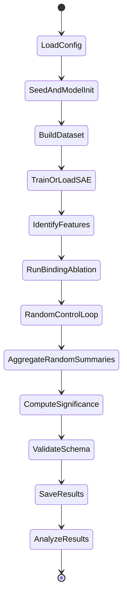

# Codebase Review Report
Date: 2026-02-09

## Findings (By Severity)

### Critical
1. [Fixed] Matched random controls were effectively deterministic and could collapse to near-identical sets.
- Evidence: `sae_experiments/ablation/ablation_experiments.py:350`, `sae_experiments/ablation/ablation_experiments.py:364`
- Root cause: deterministic nearest-neighbor matching (`min(...)`) gave the same selections across repeats.
- Impact: binding-vs-random comparisons were statistically weak/misleading.
- Fix: stochastic nearest-neighbor windowed sampling with weighted randomness (`neighbor_width`).
- Regression tests: `tests/test_random_control_sampling.py`.

2. [Fixed] Legacy token-range conditional in baseline path had an always-true branch pattern.
- Evidence: `InformationFlow.py:140`, `InformationFlow.py:142`
- Root cause: conditional style previously equivalent to always-true for one branch.
- Impact: model-token normalization path could be wrong for some model names.
- Fix: explicit tuple-membership checks.

### High
1. [Fixed] Hypothesis testing ignored multi-random-set distribution and used only first random run rows.
- Evidence: `sae_experiments/evaluation/hypothesis_tester.py:23`, `sae_experiments/evaluation/hypothesis_tester.py:44`
- Impact: p-values/effect sizes did not reflect actual random-control distribution.
- Fix: prefer `random_set_summaries` empirical test when available; fallback to paired test.
- Regression tests: `tests/test_hypothesis_tester.py`.

2. [Fixed] Task-type config parsing was inconsistent and fragile across scripts.
- Evidence: `sae_experiments/utils/config_utils.py:8`, `sae_experiments/scripts/03_run_ablation.py:80`
- Impact: empty/string/list variants could fail or silently mis-route task selection.
- Fix: centralized normalization helpers (`resolve_task_types`, `resolve_primary_task_type`).
- Regression tests: `tests/test_config_utils.py`.

3. [Fixed] SAE training default could silently mismatch feature/ablation position targeting.
- Evidence: `sae_experiments/scripts/01_train_sae.py:113`, `sae_experiments/utils/config_utils.py:31`, `sae_experiments/config/sae_config.py:30`
- Impact: training on one token subset and ablating another weakens causal signal.
- Fix: explicit precedence for training position (`CLI > training.position_type > feature_identification.position_type > question`), plus default config value.
- Regression tests: `tests/test_config_utils.py`.

4. [Fixed] Hook cleanup on failure paths was not guaranteed.
- Evidence: `sae_experiments/data/activation_collector.py:62`, `sae_experiments/ablation/feature_ablator.py:134`, `sae_experiments/ablation/feature_ablator.py:270`, `sae_experiments/knockout/knockout_runner.py:40`
- Impact: stale hooks can contaminate subsequent runs with hidden interventions.
- Fix: `try/finally` around all hook registration/use paths.
- Regression tests: `tests/test_hook_cleanup.py`.

5. [Fixed] `argparse` boolean parsing pitfall in training script.
- Evidence: `sae_experiments/scripts/01_train_sae.py:44`
- Impact: `--show_progress False` previously parsed truthy in common cases.
- Fix: strict boolean parser.

### Medium (Open)
1. `position_type == "all"` in activation collection does not include multimodal-expanded image token span.
- Evidence: `sae_experiments/data/activation_collector.py:194`
- Why it matters: if users expect truly full-sequence (post-expansion) collection, current behavior under-samples.
- Recommendation: define and document whether `"all"` means raw text-token positions or expanded multimodal sequence; add an explicit `"all_expanded"` mode if needed.

2. `n_bootstrap` exists in config but is not wired into report bootstrap call.
- Evidence: `sae_experiments/config/sae_config.py:70`, `sae_experiments/ablation/statistical_analysis.py:88`
- Why it matters: config changes may not actually affect bootstrap CI behavior.
- Recommendation: pass `ablation.n_bootstrap` into `bootstrap_confidence_interval(...)`.

3. Multi-task config shape vs. script behavior mismatch.
- Evidence: `sae_experiments/scripts/03_run_ablation.py:80`, `sae_experiments/scripts/03_run_ablation.py:134`
- Why it matters: `dataset.task_types` is list-shaped but script intentionally runs only the first task.
- Recommendation: either enforce single-element config or add explicit `--all_tasks` behavior.

4. Determinism warnings still expected on CUDA without CuBLAS workspace config.
- Evidence: `sae_experiments/utils/random_utils.py:24`
- Why it matters: “deterministic=true” does not fully guarantee reproducibility without environment setup.
- Recommendation: document/export `CUBLAS_WORKSPACE_CONFIG` in run scripts.

## Redundancies
1. Repeated dtype parsing helpers across scripts.
- Evidence: `sae_experiments/scripts/02_identify_features_causal.py`, `sae_experiments/scripts/03_run_ablation.py`, `sae_experiments/scripts/rank_features_causally.py` (scripts 02, 05 archived)
- Recommendation: centralize in one utility.

2. Repeated sequence-logprob implementations.
- Evidence: `sae_experiments/knockout/knockout_runner.py:17`, `sae_experiments/ablation/feature_ablator.py:498`, `sae_experiments/feature_analysis/feature_identifier.py:310`
- Recommendation: single shared scoring utility to avoid divergence.

3. Repeated image-token-count logic.
- Evidence: `sae_experiments/data/activation_collector.py:166`, `sae_experiments/ablation/feature_ablator.py:415`
- Recommendation: shared helper in `sae_experiments/utils`.

## Config/Parameter Discrepancies
1. List-valued `dataset.task_types` vs. single-task execution semantics.
- Evidence: `sae_experiments/scripts/03_run_ablation.py:80`, `sae_experiments/scripts/03_run_ablation.py:81`

2. Bootstrap count configured but not consumed in statistical report path.
- Evidence: `sae_experiments/config/sae_config.py:70`, `sae_experiments/ablation/statistical_analysis.py:88`

3. Training position now defaults safely, but older run configs without `training.position_type` depended on CLI discipline.
- Evidence: `sae_experiments/scripts/01_train_sae.py:113`, `sae_experiments/config/sae_config.py:30`

## Test Additions and Coverage
New tests added:
1. `tests/test_config_utils.py`
- Covers task-type normalization and training-position precedence.

2. `tests/test_random_control_sampling.py`
- Covers matched random-set diversity, seed reproducibility, and multi-set bookkeeping.

3. `tests/test_hypothesis_tester.py`
- Covers empirical random-set testing path and paired-test fallback.

4. `tests/test_hook_cleanup.py`
- Covers hook cleanup on exceptions in activation collection, feature ablation, and knockout scoring.

Test run:
1. Command: `python -m unittest discover -s tests -p 'test_*.py'`
2. Result: `Ran 21 tests ... OK`

## Pipeline State Machine

## Edge-Case Matrix
1. Empty/invalid task config.
- Covered by: `tests/test_config_utils.py`
- Status: addressed.

2. Random matched controls becoming identical.
- Covered by: `tests/test_random_control_sampling.py`
- Status: addressed.

3. Hook persistence after runtime exceptions.
- Covered by: `tests/test_hook_cleanup.py`
- Status: addressed.

4. Multi-random-set hypothesis inference.
- Covered by: `tests/test_hypothesis_tester.py`
- Status: addressed.

5. Full-sequence `"all"` position semantics for multimodal-expanded tokens.
- Covered by tests: no.
- Status: open (design/implementation clarification needed).

## Recommended Next Implementation Tasks
1. Introduce shared `scoring_utils.py` for logprob scoring to remove 3-way duplication.
2. Add explicit `"all_expanded"` position mode and tests.
3. Wire `ablation.n_bootstrap` into report generation.
4. Add `--all_tasks`/`--task_type` explicit control in `03_run_ablation.py` and enforce config shape.
